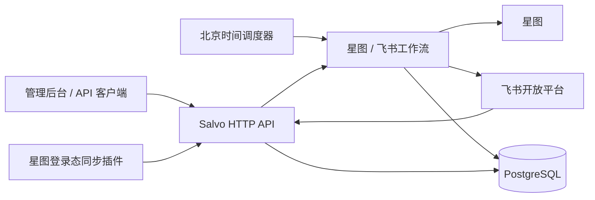

# Lark Utils Exp

面向内容运营团队的飞书 + 星图内部业务系统后端。服务负责项目与活动期次管理、星图直播/视频数据同步、飞书多维表格读写、审核结果回传、通知卡片、日报指标和管理/分析查询。

项目当前更适合部署在受控的企业网络或内部平台：管理写接口使用共享 Bearer Token，暂未实现完整的用户、角色和租户鉴权。

本项目以 [MIT License](LICENSE) 开源。开源许可不改变业务数据和第三方平台凭据的保密要求。

## 主要能力

- 主项目、星图账号、审核员、通知配置和活动期次的统一管理。
- 视频与直播星图导出、飞书 Sheet 导入、手动登记合并和 PostgreSQL 持久化。
- 星图数据优先、手动数据补充的来源合并规则。
- 视频/直播审核通知、审核结果回传和 `audit_extra` 扩展字段。
- 标签筛选、标签聚合、日期区间汇总、最新指标和周报查询。
- 飞书机器人群聊/成员代理查询、多维表数据表枚举和电子表格局部富文本格式化。
- 北京时间调度、任务运行台账、失败补偿、隔离区、卡片历史与撤回。
- HTTP `gzip` / `br` / `zstd` 压缩，以及可选的 AES-256-GCM + zstd JSON 响应保护。
- Chrome/Edge 星图登录态同步插件及 Bun 分发打包工具。
- Docker 部署、健康探针、持久化日志和 PostgreSQL 备份脚本。

## 系统结构



核心技术：Rust 2024、Salvo、SQLx、PostgreSQL、OpenLark、Tokio、Moka、Bun 和 Docker。

## 快速启动

### Docker Compose

准备 PostgreSQL 16 或兼容实例，然后复制示例配置：

```bash
cp .env.example .env
cp compose.example.yml compose.yml
```

至少修改 `.env` 中的数据库、飞书应用和加密配置。可以用 Bun 生成互不相同的随机值：

```bash
bun -e 'console.log(Buffer.from(crypto.getRandomValues(new Uint8Array(32))).toString("base64url"))'
bun -e 'console.log(Buffer.from(crypto.getRandomValues(new Uint8Array(32))).toString("base64url"))'
bun -e 'console.log(Buffer.from(crypto.getRandomValues(new Uint8Array(32))).toString("base64"))'
```

前两个值可分别用于 `MUTATION_API_TOKEN` 和 `XINGTU_SESSION_UPLOAD_TOKEN`；第三个标准 Base64 值用于 `XINGTU_SESSION_ENCRYPTION_KEY`。不要让这三个配置共用同一个值。

启动服务：

```bash
docker compose up -d
docker compose ps
curl --fail http://127.0.0.1:8080/live
curl --fail http://127.0.0.1:8080/ready
```

服务启动时会自动执行 `migrations/` 中尚未应用的 SQLx migration。已经在数据库执行过的 migration 不应修改。

### 本地开发

需要稳定版 Rust、Bun 和 PostgreSQL：

```bash
cp .env.example .env
cargo run --bin server
```

默认监听 `0.0.0.0:8080`。管理控制台、Swagger 和健康检查分别位于：

- `GET /admin-console`
- `GET /swagger-ui`
- `GET /api-doc/openapi.json`
- `GET /health`
- `GET /live`
- `GET /ready`

## 环境变量

### 核心配置

| 变量 | 必需性 | 说明 |
| --- | --- | --- |
| `DATABASE_URL` | 必需 | PostgreSQL 连接串。服务启动时连接数据库并执行 migration。 |
| `LARK_APP_ID` | 必需 | 飞书应用 App ID。 |
| `LARK_APP_SECRET` | 必需 | 飞书应用 App Secret，只能由服务端注入。 |
| `LARK_BASE_URL` | 可选 | 默认 `https://open.feishu.cn`。 |
| `SERVER_BIND_ADDR` | 可选 | 默认 `0.0.0.0:8080`。 |
| `TZ` | 推荐 | Docker 示例使用 `Asia/Shanghai`；业务日期仍由程序显式按北京时间计算。 |
| `RUST_LOG` | 可选 | 默认 `info`。`debug` 会包含较多 HTTP/OpenLark 底层日志。 |
| `LOG_DIR` | 可选 | 持久化 JSONL 日志目录；Docker 默认 `/app/logs`。 |

### 鉴权与密钥

| 变量 | 必需性 | 说明 |
| --- | --- | --- |
| `MUTATION_API_TOKEN` | 强烈推荐 | 管理和写接口共享 Bearer Token。未配置时相关接口默认拒绝访问。 |
| `ADMIN_API_TOKEN` | 兼容项 | 仅在未配置 `MUTATION_API_TOKEN` 时作为旧部署回退。 |
| `XINGTU_SESSION_UPLOAD_TOKEN` | 使用插件时必需 | 插件共享上传 Token，只允许上传登录态。 |
| `XINGTU_SESSION_ENCRYPTION_KEY` | 必需 | 标准 Base64，解码后恰好 32 字节；用于 AES-256-GCM 加密数据库中的星图登录态。 |
| `XINGTU_SESSION_ENCRYPTION_KEY_ID` | 可选 | 登录态密钥标识，默认 `primary`。 |
| `API_DATA_ENCRYPTION_KEY` | 可选 | 受保护 API JSON 响应的 32 字节标准 Base64 密钥，也可作为登录态密钥的显式回退。 |
| `API_DATA_ENCRYPTION_KEY_ID` | 可选 | API 数据保护密钥标识，默认 `primary`。 |

### CORS

允许跨域访问的域名由 `CORS_DOMAIN` 配置，推荐使用合法 JSON 数组：

```env
CORS_DOMAIN=["example.com","*.example.com","another.example","*.another.example"]
```

也兼容以下写法：

```env
CORS_DOMAIN=[example.com,*.example.com]
CORS_DOMAIN=example.com,*.example.com
```

规则说明：

- Origin 只允许 `http` 和 `https`。
- `example.com` 只匹配主域，不自动匹配子域。
- `*.example.com` 匹配任意层级子域，但不匹配主域。
- 需要同时允许主域和子域时必须分别声明。
- 规则中不能包含协议、端口、路径、查询参数或用户信息。
- 不允许全开放的 `*`。
- 未配置时服务正常启动，但不会返回跨域许可。
- 已配置但为空或格式非法时服务拒绝启动，避免静默放宽访问范围。

### 飞书数据同步与项目卡片

| 变量 | 必需性 | 说明 |
| --- | --- | --- |
| `DATA_SYNC_PUBLIC_BASE_URL` | 生产推荐 | `/meta.json` 对外生成的 HTTPS 服务根地址。 |
| `DATA_SYNC_CONFIG_UI_URL` | 可选 | 配置页独立部署时使用完整 HTTPS 地址覆盖默认地址。 |
| `DATA_SYNC_SECRET_KEY` | 生产推荐 | 飞书数据同步插件 Verification Token；未配置只适合本地调试。 |
| `PROJECT_REPORT_TEMPLATE_ID` | 发送日报时必需 | 不含热点内容的飞书项目汇报卡片模板 ID。 |
| `PROJECT_REPORT_WITH_HOT_VIDEOS_TEMPLATE_ID` | 发送日报时必需 | 含热点内容的飞书项目汇报卡片模板 ID。 |

项目审核模板、登录异常模板、通知群、审核员和星图账号通过项目管理接口保存到数据库，不应硬编码到仓库。

### 本地登录态调试

`XINGTU_ACCOUNT_ID`、`XINGTU_COOKIE`、`XINGTU_CSRF_TOKEN`、`XINGTU_SESSION_KEY` 和 `XINGTU_USER_AGENT` 只用于本地调试。配置 Cookie 与 CSRF Token 时必须同时显式设置账号 ID。不要在生产配置文件、日志、Issue 或插件源码中提交真实登录态。

## 项目和工作流模型

稳定的主项目拥有自己的：

- 通知群和飞书卡片模板；
- 一个或多个星图账号；
- 项目审核员；
- 多个活动期次。

每个活动期次再配置直播/视频内容任务、业务多维表、审核表、手动登记表、追踪窗口和调度开关。自动工作流只运行启用且处于追踪窗口内的期次，并按项目串行执行。

内置调度全部按 `Asia/Shanghai`：

- `periodic`：03:00、15:00、21:00；
- `morning`：09:00；
- `night`：23:59。

`tracking_end_date` 结束后的北京时间 T+1 03:00 仍会执行最后一次更新，T+1 09:00 起不再拉取。

## API 与数据安全

完整 API 示例见 [docs/api.md](docs/api.md)，Swagger 以运行中服务生成的 OpenAPI 为准。

普通大响应支持标准 HTTP 压缩：

```bash
curl --compressed https://api.example.com/api/v1/queries/videos
```

受信任服务端客户端还可以请求应用层保护：

```http
X-Data-Protection: aes-256-gcm+zstd
```

服务会先使用 zstd 压缩 JSON，再使用 AES-256-GCM 加密并返回信封。Bun 解密示例和密钥轮换说明见 [docs/data-protection.md](docs/data-protection.md) 与 [scripts/decrypt-data.ts](scripts/decrypt-data.ts)。HTTPS 仍然是必需的传输保护，应用层信封不能替代 TLS。

`audit_extra` 顶层字段名 `key` 被视为保密筛选字段：允许作为查询条件，但不会出现在详情、汇总响应或查询缓存键中。其他扩展字段的归一化和查询语义见 [docs/audit-extra.md](docs/audit-extra.md)。

## 星图登录态插件

插件源代码位于 `browser-extensions/xingtu-session-uploader/`。实际分发包会嵌入共享的 `XINGTU_SESSION_UPLOAD_TOKEN` 和指定星图账号 ID，因此 ZIP 属于内部凭据载体，不应公开发布。

```bash
cp config/xingtu-extension-packages.example.json config/xingtu-extension-packages.json
bun scripts/package-xingtu-extension.ts
```

私有配置和生成的 ZIP 已由 `.gitignore` 排除。详细打包、校验和 Token 轮换流程见 [browser-extensions/xingtu-session-uploader/README.md](browser-extensions/xingtu-session-uploader/README.md)。

## 开源安全边界

当前仓库已经忽略 `.env`、私钥/证书、数据库备份、本地导出、真实活动配置、日志、依赖、构建产物和插件分发包。真实业务导出及活动配置的本地副本可放在 `private-data/`，该目录不会进入 Git 或 Docker build context。

2026-08-19 的开源整理将当前脱敏快照重建为单一根提交，并从仓库引用和本地对象库中清除了旧 `.env`、真实业务导出及真实活动配置的历史。首次推送公开远端前仍必须：

1. 轮换所有曾经提交过的凭据，至少包括旧历史 `.env` 中出现过的飞书 App Secret。
2. 将旧历史私密 bundle 仅保存在受控位置，不得上传到公开仓库、Release 或公共网盘。
3. 在隔离目录重新克隆拟公开仓库，确认 `.env`、`private-data/`、插件 ZIP、数据库备份和日志不存在。
4. 重新执行 Secret Scanning；在托管平台启用 Push Protection 和依赖更新提醒。
5. 确认发布源码包和二进制分发说明保留 MIT `LICENSE`。

本次检查的证据、已处理项和剩余人工动作见 [docs/open-source-security-audit.md](docs/open-source-security-audit.md)。

## 许可证

代码依据 [MIT License](LICENSE) 发布。你仍需自行确认飞书、星图及其他第三方服务、SDK、素材和业务数据的使用许可；MIT License 不授予这些第三方内容或数据的权利。

## 质量检查

提交前至少执行：

```bash
cargo fmt --all -- --check
cargo check --all-targets
cargo test --all-targets
cargo clippy --all-targets -- -D warnings
bun test scripts/package-xingtu-extension.test.ts
git diff --check
```

飞书数据同步配置页还应执行：

```bash
cd web/data-sync-config
bun install --frozen-lockfile
bun test
bun run typecheck
bun run build
```

GitHub Actions 会在 `main` 和 `master` 分支 push 以及 pull request 时运行对应检查。

## Docker 发布

正式 Docker 发布前必须先提交全部变更，然后使用项目的 Bun 发布脚本：

```bash
bun scripts/docker-release.ts
```

脚本从 `Cargo.toml` 读取基础 SemVer，构建并推送 `latest`、基础版本和不可变构建标签，并核对镜像 digest。完整部署、回滚、备份和日志说明见：

- [Docker 部署](docs/docker-deploy.md)
- [运维、备份与故障恢复](docs/operations-runbook.md)
- [API 数据保护与解密](docs/data-protection.md)
- [飞书电子表格文本格式化](docs/admin-spreadsheet-formatting.md)

## 数据与隐私边界

请勿提交或公开：

- 飞书 App Secret、管理员 Token、数据同步 Verification Token；
- 星图 Cookie、CSRF Token、session key、登录态加密根密钥；
- 真实账号 ID、审核员 ID、群聊 ID、卡片模板 ID 和组织专属表格链接；
- 真实视频/直播导出、数据库 dump、业务日志和插件分发 ZIP；
- 包含敏感筛选值的 `audit_extra.key` 数据。

公开 Issue、日志片段和复现数据应先脱敏。任何曾进入 Git 历史的秘密都应视为已经泄漏并立即轮换。
